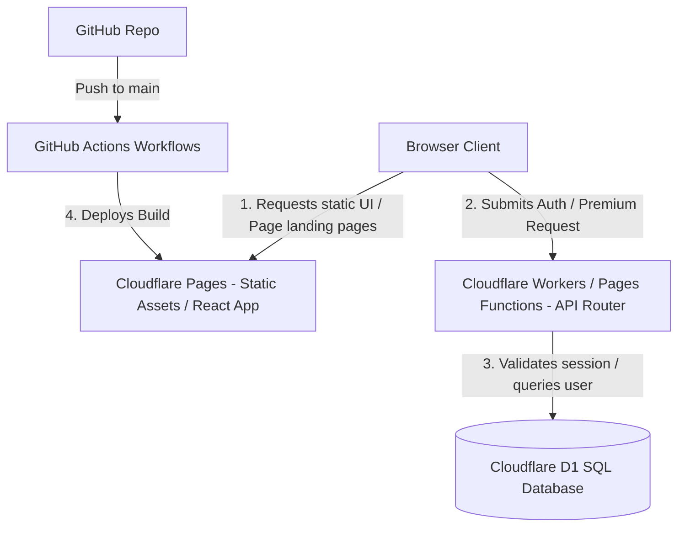

# Product Requirements Document (PRD)
## Project Name: Personal Profile & Interactive Tools Hub
**Status:** Planning
**Target Deployment:** Cloudflare Pages & Workers

---

## 1. Product Overview & Vision
The goal of this project is to build a premium, personal portfolio website that acts as a launcher and host for small, browser-based online tools (utilities). The platform will support dual-mode access: public utilities for guest visitors, and restricted/premium tools for registered or paid users. 

To maximize organic search traffic, the site will feature standalone HTML landing pages optimized for search engines (SEO) to promote individual tools.

---

## 2. Key Objectives & Goals
* **Self-Contained Ecosystem:** Host both the frontend app and the backend authentication layer entirely on Cloudflare (Pages, Workers, and D1 Database) to keep hosting costs near zero while maintaining high scalability.
* **Minimalis Japandi Casual Aesthetic:** A calming, minimalist aesthetic fusing Japanese simplicity and Scandinavian warmth. Casual layout with off-white, beige, and warm gray tones, wooden/natural accent details, clean borders, and soft organic animations.
* **Seamless User Flow:**
  - Clear guest entry points for public tools.
  - Simple signup/login flow to unlock restricted tools.
* **SEO Excellence:** Each tool will have a dedicated static promotional page to rank on search engines, backed by an automated `sitemap.xml`.
* **Continuous Delivery:** 100% automated deployments via GitHub Actions to Cloudflare Pages on push to the repository.

---

## 3. Architecture & Technology Stack

### Technology Matrix
* **Frontend SPA:** React 18+ built with Vite.
* **Styling:** Modular Vanilla CSS, employing CSS Variables for themes and animations.
* **Database:** Cloudflare D1 (Serverless SQL Database) to store user credentials, active sessions, and access permissions.
* **Backend Functions:** Cloudflare Pages Functions (Worker-based middleware) to secure API routes and manage sessions.
* **CI/CD:** GitHub Actions using the official `cloudflare/wrangler-action`.

---

## 4. Routing & Access Control Specifications

### URL Structure
* `/` — Main profile home page with personal bio and directory of tools.
* `/apps/{app-slug}` — Mount point for specific interactive tools.
* `/apps/account` — Centralized login, registration, and user subscription tier management.
* `/posts/{app-slug}.html` — SEO-optimized, indexable static HTML promotional landing pages.

### Access Levels
| Tool Slug | Target Audience | Access Gate | Storage/APIs Used |
| :--- | :--- | :--- | :--- |
| `json-formatter` | Public / Guest | None (Client-only) | Local Storage |
| `base64-codec` | Public / Guest | None (Client-only) | Local Storage |
| `hash-generator` | Public / Guest | None (Client-only) | Web Crypto API |
| `premium-analytics` | Registered/Paid | Route Guard + Active Session | D1 User DB |

---

## 5. Security & Session Integrity
We implement strict secure-by-design patterns to safeguard the platform:
1. **Cookie-Based Sessions:** Session tokens are transmitted via cookies with the following attributes:
   - Name: `__Host-Session-Token` (binds to domain and path `/`).
   - `HttpOnly`: Prevents client-side scripts from reading the token (protects against XSS token extraction).
   - `Secure`: Ensures tokens are only sent over HTTPS.
   - `SameSite=Lax`: Prevents Cross-Site Request Forgery (CSRF) on standard navigations.
2. **Password Safety:** Raw passwords are never stored in D1. Passwords will be processed using salt-based memory-hard hashing functions.
3. **No Code Secrets:** No API keys or database connection strings are stored in code. All configuration values will be fetched through Cloudflare Worker bindings.

---

## 6. SEO & Sitemap Requirements
* **Promotional Pages:** Raw, performant static HTML files inside the `public/posts/` directory. They will have pre-rendered descriptions, structured schema markup, and clear CTA buttons leading users to launch the tool.
* **Heading Hierarchy:** Each landing page will have exactly one `<h1>` tag containing target search keywords, followed by structured `<h2>` and `<h3>` tags describing features.
* **Sitemap Automation:** A post-build script will run to compile all React routes, static promotional landing pages, and root paths into a production `sitemap.xml` placed in the web root.

---

## 7. CI/CD & Deployment Flow
When code is pushed to the `main` branch:
1. GitHub runner sets up Node.js environment.
2. Dependencies are installed and linting is performed.
3. React application builds static files into `dist/`.
4. Sitemap generator runs, appending `/sitemap.xml` to `dist/`.
5. Wrangler Action pushes static files and Cloudflare Functions to the Cloudflare environment.
